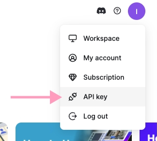

# Step 1: Generate your API key

1. Navigate to your Workspace-Account-API Key

2. Click the "**Generate API Key**" button. Your unique API key will be displayed within seconds. **Note**: This feature requires a Pro plan.